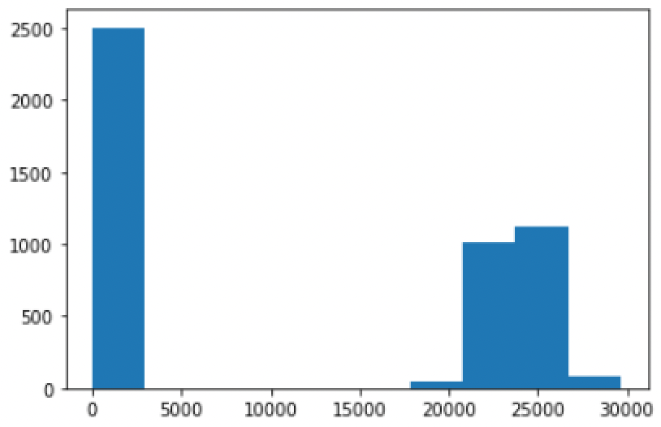
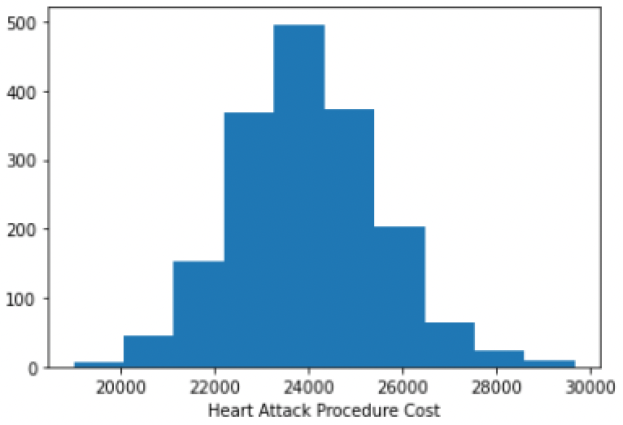
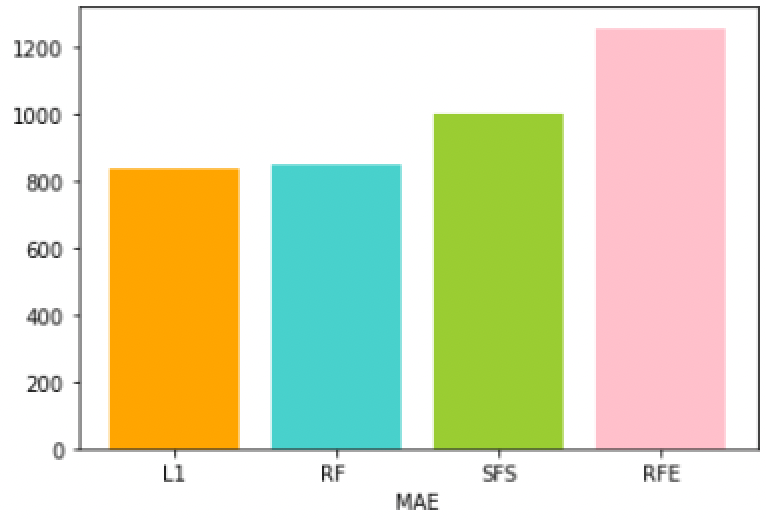
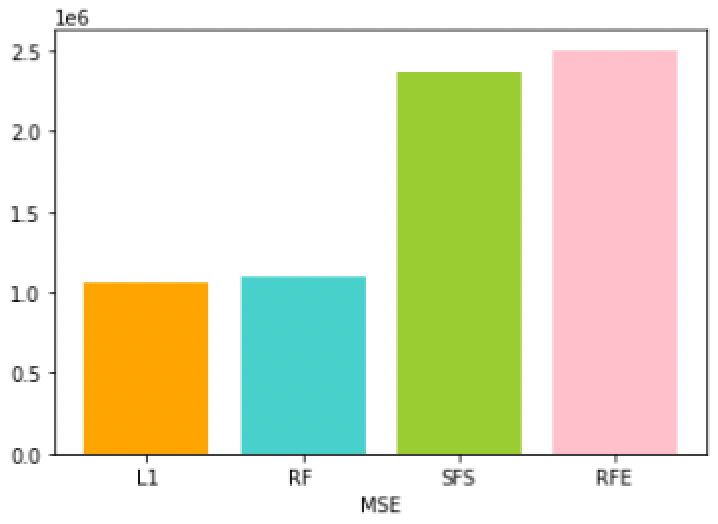
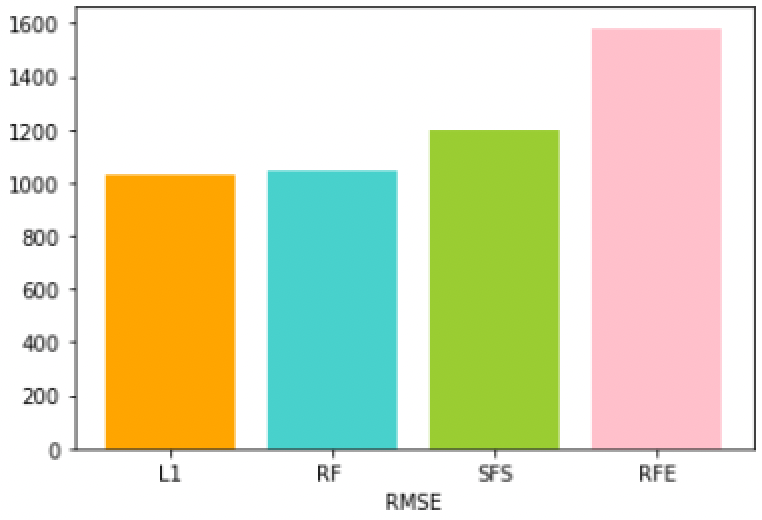
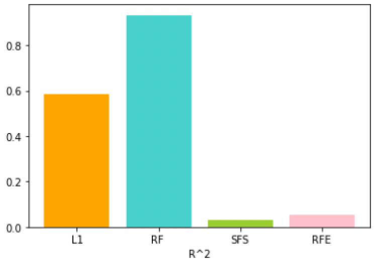
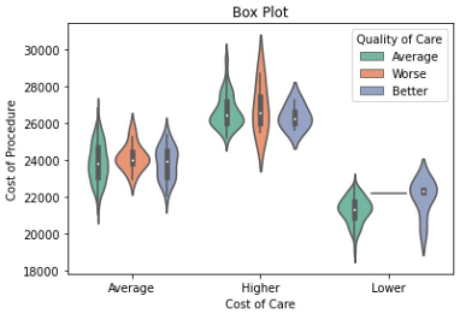
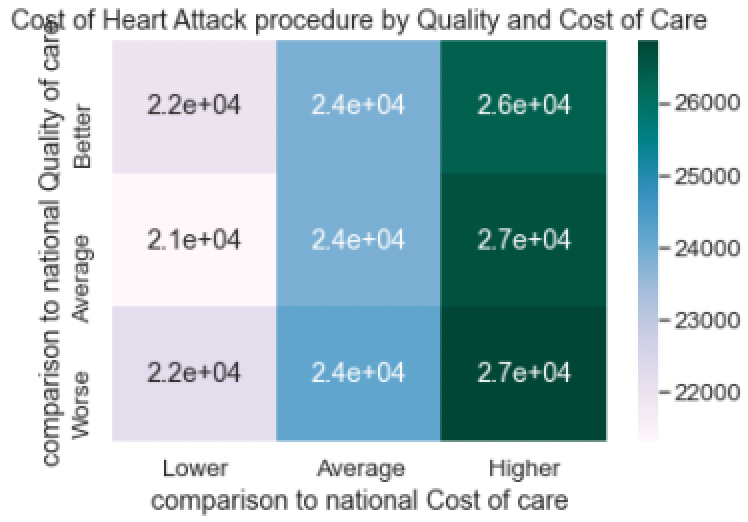

# FM_MLfinalProject.github.io
MAP 6114 Machine Learning UWF Final Project

I have worked on the hospital data from the CORGIS Dataset Project. This dataset provides hospitals performance measure information related to heart attack, emergency department care, preventive care, stroke care, and other conditions. The data is part of an Administration-wide effort to increase the availability and accessibility of information on quality, utilization, and costs for effective, informed decision-making.
 
It has 24 columns, among which 4 are regarding location, 8 are related to various rating status, the rest are some information about heart attack, pneumonia and hip-knee procedures.
I have decided to model heart attack cost procedure using other information present in this dataset. I wanted to see if there is any indication about how much a heart attack procedure will cost based on its location,  ratings or facility type.
 
First, since procedure cost is a continuous variable, I used linear regression for modeling. For independent variables I tried various rating measures, to see if a facility's rating can predict the heart attack procedure cost, or if they do, which ones would be most significant.
 
First, I loaded the data, then for data pre-processing, I looked at our dependent variable for possible outlier, or discrepancy. From the histogram it is evident that there are lots of rows with values around 0 for this column. It may be possible that the cost information for those facilities are not present, or presented incorrectly. In any case, we have to get rid of them to find proper predictors.
I filtered the column to keep values ranging from 18000.

Next, I looked at the rating measures, I saw that the values are presented as how they stand against the national average. The possible values are the same, above, or below. Among them, a significant amount of rows consists of None value, so I needed to filter these out too.
The variables we are using as predictors are all categorical in nature. For linear regression using scikit-learn, we need to have number values in the predictors. So, I created dummy variables for the model.
 
We want to predict how much a heart attack procedure will cost, so this will be our dependent variable.
 
For splitting the data into a train and test set, I did a 70-30 split.
 
I created a linear regression model and fit the data on training sets. After that, I used the model to predict the test dataset.
 
The r^2 value is used to evaluate the performance of a regression-based machine learning model. It is the coefficient of determination. It works by measuring the amount of variance in the predictions explained by the dataset. The higher the R^2 values, the better the model fit data.

Based on the results, we see that the model is not a good model. From the model summary, we can also see that no rating measures come out as significant for an alpha value=0.05.
 
The other information presented in the database are location and facility type. I tried to see if the facilities' type and location could be good indicators for a procedure cost.
 
After following the same steps of linear regression for the new predictors, I generated the R^2 value.
 
The two linear regression models have significantly different R-squared values. The first model, with safety rating and experience rating as predictors, has a very low R-squared value of 3.66%, indicating that only a small portion of the variation in the cost of heart attack procedures is explained by these variables. On the other hand, the second model, with facility type and location as predictors, has a much higher R-squared value of 76%, indicating that a large portion of the variation in the cost of heart attack procedures can be explained by these variables.
 
The 2nd model showed better results than the 1st one. So, the city where the hospital is located, and whether it is government owned, private or proprietary.

To improve model's performance and interpretation, I also used feature selection techniques such as LASSO regularization, Recursive Feature Elimination (RFE) etc. to identify the most relevant predictors.

## L1 Regularization
LassoCV is a linear model that uses L1 regularization to identify the most significant features in a dataset. The algorithm adds a penalty term proportional to the absolute value of the coefficients, which helps to shrink the coefficients of less important features to zero. LassoCV is often used in high-dimensional datasets where many features may not be significant. The algorithm performs cross-validation to estimate the best value for the regularization parameter alpha.

## Random Forest Regression
RandomForestRegressor is an ensemble method that uses a combination of decision trees to predict the target variable. The algorithm builds multiple decision trees on a bootstrapped sample of the dataset and randomly selects a subset of features at each node to split on. The final prediction is then the average of all the predictions made by the decision trees. RandomForestRegressor is often used when dealing with non-linear relationships between features and the target variable.

## Sequential Feature Selection
Sequential feature selection is a greedy algorithm that selects the best feature at each iteration and adds it to the model. The algorithm starts with an empty set of features and iteratively adds the best feature that maximizes the model's performance. This process continues until the desired number of features is selected. Sequential feature selection is often used in datasets where the number of features is relatively small.

## Recursive Feature Elimination
Recursive feature elimination is another greedy algorithm that recursively removes features from the dataset until the desired number of features is selected. The algorithm starts with all the features and trains the model. It then removes the least significant feature and retrains the model until the desired number of features is reached. Recursive feature elimination is often used in high-dimensional datasets where the number of features is significant.
 
## Result

We can see the scores of each model in Figure 2. We calculated the mean squared error (MSE), mean absolute error (MAE), root mean squared error (RMSE), and $R^2$ value. The LassoCV/L1 regularization method resulted in the lowest MSE and MAE values, with an $R^2$ value of 0.58. The Random forest feature selection method had the highest $R^2$ value of 0.93, indicating a better fit for the model.

However, we can see from the selected features that RF  picked 322 features, and hence provided a better result. Whereas, L1, SFS, and RFE all gave us fewer features as important. Though these 3 models gave us a worse $R^2$, they predicted the target using just less features. L1 method has lower MAE, MSE, RMSE and high $R^2$, which can't be said about the SFS and RFE methods. It makes L1 comparably better among the 4 models.

## Procedure cost VS Care cost and Care quality
We also investigated relation among a procedure cost with its care cost and quality. The procedure cost is a continuous variable, and care cost and quality are categorical variable. First plot is a boxplot showing the distribution of procedure cost based on the other two variables. 2nd figure shows a heatmap which reveals a linear relationship among these variables. Which means as the care cost goes higher than national average and care quality gets better than national average, the procedure cost also increases.

Similar analysis can be done for the other procedures as well.

More detailed analysis could be possible based on the features selected by each methods. The possible explanation behind picking the features, and how they may affect a procedure cost provides a promising ground for further exploration.

In summary, our results suggest that careful selection of feature selection methods can significantly improve the performance of regression models, and LassoCV and RandomForestRegressor are promising approaches to consider in this context.
